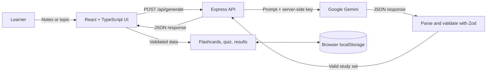

# StudyFlow AI

StudyFlow AI turns study notes or a topic into a focused learning session with interactive flashcards and a quiz. Generated content is validated structured data, rendered as a study interface rather than a chat conversation.

**Live app:** [studyflow-ai-m2jy.onrender.com](https://studyflow-ai-m2jy.onrender.com/)

## Features

- Generate a structured study set from notes or a topic using Google Gemini.
- Review flashcards one at a time, reveal answers, move through the deck, and mark cards as known or needing review.
- Take a multiple-choice quiz with immediate feedback and explanations.
- View a score and accuracy by topic; topics with mistakes are shown for review.
- Retry only missed questions using the existing quiz data without another AI request.
- Save the latest set and learning progress in browser `localStorage`, then continue after a reload.
- Use the responsive interface on desktop, tablet, and mobile.

## Novelty features

1. **Weak-topic detection:** groups quiz mistakes by topic, sorts topics by mistake count, and displays accuracy to help focus review.
2. **Smart retry mode:** creates a retry quiz from only the missed questions and reports a separate retry score.
3. **Latest-session memory:** saves the current study set and progress in the browser so a learner can resume without an account or server-side session database.

## Architecture



### Request flow

1. The learner enters notes or a topic in the React interface.
2. `src/api.ts` sends the input to `POST /api/generate`.
3. `server/index.ts` validates the input and calls Gemini with a server-side API key.
4. The server parses and validates Gemini's JSON response with the shared Zod schema before returning it.
5. The browser validates the response again. React renders the validated study set and computes quiz results from its structured data.
6. Session progress is stored locally in the browser.

## Study-set data

Each generated study set contains a title, summary, and difficulty, plus flashcards and quiz questions. Cards include a question, answer, topic, and difficulty. Quiz questions include four answer choices, the correct choice index, an explanation, and a topic.

The shared Zod schema checks required fields, item counts, difficulty values, answer indexes, exactly four quiz choices, unique IDs, and distinct quiz questions.

## Tech stack

| Area | Technology | Purpose |
| --- | --- | --- |
| Frontend | React 18, TypeScript | Interface, typed data, and interactive state |
| Build tooling | Vite 6 | Development server and production build |
| Backend | Node.js, Express 4 | API endpoint and server-side AI requests |
| AI | Google GenAI SDK (`@google/genai`), Gemini | Study-set generation |
| Validation | Zod | Validate API input, model output, and saved sessions |
| UI | CSS, lucide-react | Responsive design and icons |
| Persistence | Browser `localStorage` | Save the latest study session |

## Run locally

Requirements: Node.js 20 or later and a Gemini API key.

```powershell
git clone https://github.com/REDDIPALLIPHANIKOUSHIK/StudyFlow-AI.git
Set-Location StudyFlow-AI
npm install
Copy-Item .env.example .env
notepad .env
```

Set the following values in `.env`:

```env
GEMINI_API_KEY=your_key_from_google_ai_studio
GEMINI_MODEL=gemini-3.5-flash
PORT=3001
```

Start the app:

```powershell
npm start
```

Open the Vite URL printed in the terminal, normally `http://localhost:5173`. `npm start` launches the Vite frontend and Express API in local development. In production, it starts the Express server that serves the built frontend.

Create or manage a Gemini API key in [Google AI Studio](https://aistudio.google.com/app/apikey). Keep the key in the server environment; do not add it to frontend code or commit `.env`.

## Configuration

| Variable | Required | Default | Description |
| --- | --- | --- | --- |
| `GEMINI_API_KEY` | Yes for generation | — | Server-side Gemini API key |
| `GEMINI_MODEL` | No | `gemini-3.5-flash` | Gemini model identifier |
| `PORT` | No | `3001` | Express server port |

## Project structure

```text
src/
  App.tsx       Main screens and learning interactions
  api.ts        Frontend API request and response validation
  storage.ts    Safe local-session persistence
  types.ts      Zod schemas and TypeScript data types
  style.css     Responsive layout and interaction styles
  main.tsx      React entry point
server/
  index.ts      Express API, Gemini request, and output validation
scripts/
  start.mjs     Select local development or production startup
docs/
  PROJECT_REPORT.md  Detailed technical walkthrough
```

## Privacy and limitations

- Study notes are sent to Google Gemini to generate study content. Do not enter sensitive personal information.
- The Gemini key stays on the server. StudyFlow has no user accounts or server-side study history.
- Only the latest study session is saved, in the current browser's local storage. It does not sync between devices.
- Generation requires network access and a valid Gemini API key.
- The project does not include an automated test suite.

## Development notes

- **AI usage:** ChatGPT/Codex assisted with planning, troubleshooting, code review, and documentation. Suggestions were reviewed and adapted for this project.
- **Time spent:** Approximately 6 hours.

