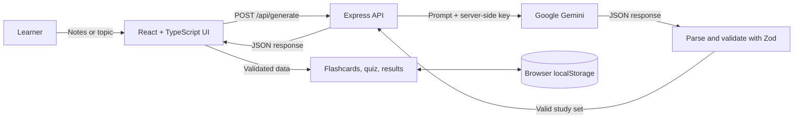

# StudyFlow AI

**Turn notes or a topic into a focused, interactive study session.** StudyFlow AI creates validated flashcards and a quiz with explanations. It is a study tool, not a chatbot: generated JSON is checked before the interface uses it.

**Live app:** [studyflow-ai-m2jy.onrender.com](https://studyflow-ai-m2jy.onrender.com/)

## Assignment requirements

| Core requirement | How StudyFlow implements it |
| --- | --- |
| React hooks and functional components | React 18 with TypeScript; state drives the screens and interactions. |
| Free-form input | Learners enter notes or a topic in a text area with a 12,000-character limit and example prompts. |
| Real AI model, with key kept private | Express sends the request to Google Gemini. The API key is read on the server from `GEMINI_API_KEY`; it is never sent to the browser. |
| Structured AI output, parsed before display | Gemini is asked for JSON matching the study-set contract. The server parses and validates it with Zod, and the browser validates the response again before rendering it. |
| Interactive, stateful result | Learners reveal and rate flashcards, navigate the deck, answer multiple-choice questions, and see explanations and results. |
| Defensive AI and network handling | Empty, malformed, or invalid model output is rejected. The app displays errors, supports retry, applies a request timeout, and ignores stale responses. |
| Loading, error, and empty-input handling | The generate action has a loading state; input validation and backend/network failures have visible messages. |
| Mobile layout | Responsive CSS adapts the layout and touch controls to smaller screens. |
| README and local run instructions | Setup, stack, architecture, AI use, limitations, and run/build commands are documented below. |

## Novelty features

1. **Weak-topic detection** — quiz mistakes are grouped by topic and sorted by mistake count, with accuracy shown for topics to review. If there are no mistakes, the results say so. It uses existing quiz data and makes no extra AI request.
2. **Smart retry mode** — the retry quiz contains only missed questions, reuses the original questions, and reports a separate retry score.
3. **Latest-session memory** — the latest study set and learning progress are stored in browser `localStorage`. Learners can continue after reloading without creating an account or sending session history to a database.

## Architecture



### Request and data flow

1. The learner enters notes or a topic. The browser checks the input length and shows loading feedback.
2. `src/api.ts` sends the text to `POST /api/generate`. An `AbortController` enforces a 90-second timeout, and a request ID prevents an older response from replacing a newer one.
3. `server/index.ts` validates the request and calls Gemini using the server-only `GEMINI_API_KEY`.
4. The server parses the model response and validates its shape with the shared Zod schema. Invalid or empty output becomes a clear error response; raw model text is never rendered.
5. The browser validates the returned JSON again, then React renders the study set and computes quiz and topic results from its data.
6. Session progress is saved locally in the browser. It is not sent to a StudyFlow database.

### Study-set data contract

```ts
type StudySet = {
  title: string
  summary: string
  difficulty: 'beginner' | 'intermediate' | 'advanced'
  cards: Array<{
    id: string
    question: string
    answer: string
    topic: string
    difficulty: 'easy' | 'medium' | 'hard'
  }>
  quiz: Array<{
    id: string
    question: string
    options: [string, string, string, string]
    correctAnswer: number
    explanation: string
    topic: string
  }>
}
```

The Zod schema enforces non-empty fields, item counts, difficulty values, exactly four options, valid answer indexes, unique IDs, and distinct quiz questions.

## Tech stack

| Area | Technology | Role |
| --- | --- | --- |
| Frontend | React 18, TypeScript | Components, typed data, and interactive state |
| Build tooling | Vite 6 | Local development and production build |
| Backend | Node.js, Express 4 | API proxy and server-side secret handling |
| AI | Google GenAI SDK (`@google/genai`), Gemini | Structured study-set generation |
| Validation | Zod | Request, AI response, and saved-session validation |
| UI | CSS, lucide-react | Responsive styling and icons |
| Persistence | Browser `localStorage` | Save and restore the latest session |

## Run locally

Requirements: Node.js 20 or later and a Gemini API key.

```powershell
git clone https://github.com/REDDIPALLIPHANIKOUSHIK/StudyFlow-AI.git
Set-Location StudyFlow-AI
npm install
Copy-Item .env.example .env
notepad .env
```

Set the values in `.env` and save the file:

```env
GEMINI_API_KEY=your_key_from_google_ai_studio
GEMINI_MODEL=gemini-3.5-flash
PORT=3001
```

Start the frontend and API together:

```powershell
npm run dev
```

Open the Vite URL printed in the terminal (normally `http://localhost:5173`). Keep the terminal open while using the app. Create or manage a Gemini key in [Google AI Studio](https://aistudio.google.com/app/apikey). Never commit `.env` or paste the key into frontend code; `.env` is ignored by Git.

## Commands

| Command | Purpose |
| --- | --- |
| `npm run dev` | Run the Vite frontend and Express API together for local development. |
| `npm run build` | Type-check and build the frontend for production. |
| `npm start` | Start the Express server; the deployed Render service uses this with the production build. |

## Configuration

| Variable | Required | Default | Description |
| --- | --- | --- | --- |
| `GEMINI_API_KEY` | For generation | — | Server-side Gemini credential. |
| `GEMINI_MODEL` | No | `gemini-3.5-flash` | Gemini model identifier. |
| `PORT` | No | `3001` | Express server port. |

## Project layout

```text
src/
  App.tsx       Main screens and study interactions
  api.ts        Browser request and response validation
  storage.ts    Safe local-session persistence
  types.ts      Zod schemas and TypeScript data types
  style.css     Responsive design and interaction states
  main.tsx      React entry point
server/
  index.ts      Express API, Gemini request, and server validation
docs/
  PROJECT_REPORT.md  Extended technical walkthrough
```

## Privacy and limitations

- Notes are sent to Google Gemini to generate the study set. Do not submit sensitive personal information.
- The Gemini key stays in the server environment. The app has no user accounts or server-side study history.
- Only the latest session is saved, in the current browser's local storage; it does not sync between devices.
- Generation requires network access and a valid Gemini API key. There is no mock-data fallback.
- The project does not currently include an automated test suite; use the manual checks below and run the production build.

## Manual verification

Run through these checks before a release or assessment demo:

- Generate a set from a topic and from pasted notes; confirm a loading state and interactive cards appear.
- Reveal, rate, and navigate flashcards; start the quiz and check both correct and incorrect feedback.
- Finish with a missed answer and confirm only its topic is shown for review; retry and confirm only missed questions are included.
- Finish with all correct answers and confirm the no-weak-topics message appears.
- Reload and continue the saved session; check the input, missing-key, unavailable-backend, and timeout messages.
- Check a narrow mobile viewport and run `npm run build`.

## AI-use note and time spent

Codex was used during development to assist with implementation troubleshooting, code refinements, and project documentation. The candidate should be prepared to explain the submitted code and verify that this note reflects all AI assistance used.

**Time spent:** Replace this line with your actual total before submission.

