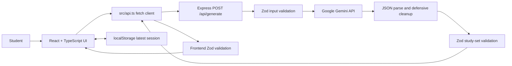

# StudyFlow AI — Technical and Project Report

This report explains the application from the user's first click through Gemini generation, validation, study interactions, scoring, retry, and saved progress. It is written to help a new developer understand and present the project, not just to list its dependencies.

## 1. Project in one paragraph

StudyFlow AI turns a topic or a student's notes into a small, interactive study session. The React interface sends the notes to an Express endpoint. Express asks Google Gemini for a structured study set, then parses and validates the response before returning it. React validates it again and renders it as flashcards and a quiz. The app calculates scores and weak topics from the structured quiz data, lets students retry missed questions, and saves the latest study set and progress in that browser's `localStorage`.

The application is a study tool, not a chatbot: it has no chat history or chat-bubble interface, and it never displays the raw model response.

## 2. What a student can do

1. Enter a topic or paste notes in the landing page.
2. See the character count and example prompts. Blank, whitespace-only, too-short, and over-limit submissions cannot be generated. The input limit is 12,000 characters; text is not silently truncated.
3. Generate a study set with the **Generate study set** button. During the request, the button shows a loading state.
4. Read the study-set title and summary, then flip flashcards to reveal answers.
5. Mark a revealed card **Got It** or **Didn't Know**. The app tracks viewed, mastered, and missed card IDs and displays progress.
6. Take a quiz one question at a time. Selecting an option immediately marks it correct or incorrect, locks that question, and displays its explanation.
7. Review the quiz score, correct and incorrect totals, and topic-level accuracy.
8. Retry only missed questions. The app reuses the original question objects; retry does not call Gemini again.
9. Return later and continue the latest saved study session, or clear it and start a new set.

## 3. Architecture at a glance



The server and browser share the Zod schema in `src/types.ts`. That makes their understanding of a valid study set consistent. Both still validate: the server is the boundary between the model and the API response; the browser is the final boundary before generated data is rendered.

## 4. Technology choices

| Technology | What it does here | Why it fits this project |
| --- | --- | --- |
| React 18 | Renders the landing, study, quiz, and result views | Keeps interactive state close to the UI that uses it |
| TypeScript | Types the app state, API result, and saved session | Helps catch code mistakes while editing and compiling |
| Vite 6 | Runs the frontend in development and creates the static production build | Small setup and quick React builds |
| Node.js + Express 4 | Receives generation requests and talks to Gemini | Keeps the API key off the browser |
| Google GenAI SDK (`@google/genai`) | Calls Gemini using JSON response mode | Provides the official JavaScript client |
| Gemini `gemini-3.5-flash` | Generates study cards and quiz questions | Configurable with `GEMINI_MODEL` |
| Zod | Checks untrusted JSON and session data at runtime | TypeScript types alone disappear at runtime and cannot validate a model response |
| CSS | Provides the visual layout, mobile rules, and focus/feedback states | Avoids an extra styling framework for this small app |
| `lucide-react` | Provides interface icons | Consistent, lightweight icon components |
| `localStorage` | Saves the latest study session in the browser | Meets the assignment's no-database requirement |

There is no Redux/Zustand, database, authentication system, chatbot, or mock AI fallback.

## 5. Repository map

```text
StudyFlow-AI/
├── src/
│   ├── App.tsx          Main screen flow and study interactions
│   ├── api.ts           POST request, network errors, frontend response validation
│   ├── storage.ts       Safe load/save/clear helpers for the latest session
│   ├── types.ts         Shared Zod schema and TypeScript data types
│   ├── style.css        Visual design, responsive rules, and interaction states
│   ├── main.tsx         React application entry point
│   └── vite-env.d.ts    Vite client type definitions
├── server/
│   └── index.ts         Express API, Gemini request, output parsing and validation
├── docs/
│   └── PROJECT_REPORT.md This report
├── index.html           Browser document shell and page title
├── vite.config.ts       React plugin and /api development proxy
├── package.json         Dependencies and npm scripts
├── package-lock.json    Locked dependency versions
├── .env.example         Example server configuration
└── .gitignore           Excludes .env, node_modules, and build output
```

`App.tsx` contains small view functions for the home screen, flashcard study screen, quiz screen, and results screen. The views receive callbacks and data from the top-level `App` state. This keeps one simple state owner without adding a global state library.

## 6. AI request, step by step

1. `HomeView` collects the student's notes. Its button is disabled unless the trimmed text is at least three characters and no more than 12,000 characters.
2. `handleGenerate` starts an `AbortController`, assigns a monotonically increasing request ID, starts a 30-second timer, and shows loading state.
3. `src/api.ts` sends `POST /api/generate` with `{ "input": "..." }` as JSON.
4. `server/index.ts` validates the body with Zod. Invalid input gets HTTP 400. Missing `GEMINI_API_KEY` gets HTTP 503 with a configuration message.
5. The server creates a `GoogleGenAI` client from the key in the server environment and calls `models.generateContent`. `GEMINI_MODEL` chooses the model; if unset, the server uses `gemini-3.5-flash`.
6. Gemini is asked for JSON containing a title, summary, difficulty, flashcards, and quiz items. The prompt also tells the model to treat pasted notes as source material rather than instructions.
7. The server handles an empty response, strips optional Markdown JSON fences, and runs `JSON.parse` inside a `try/catch`.
8. Parsed model data is still untrusted. The server calls `studySetSchema.safeParse`; invalid shape or values get HTTP 502 and a user-friendly error. Only `validated.data` is returned.
9. `src/api.ts` checks the HTTP status, content type, and frontend Zod schema. It does not pass raw text into React.
10. `handleGenerate` checks that its request ID is still current before saving the result and navigating to the study view.

## 7. Data contract and validation

The `StudySet` schema contains:

- `title`: required non-empty string, up to 100 characters.
- `summary`: required non-empty string, up to 600 characters.
- `difficulty`: `beginner`, `intermediate`, or `advanced`.
- `cards`: 5–10 cards. Each has a unique `id`, non-empty question, answer, topic, and an `easy`, `medium`, or `hard` difficulty.
- `quiz`: 5–10 questions. Each has a unique `id`, non-empty question, exactly four non-empty options, integer `correctAnswer` from 0 to 3, non-empty explanation, and topic.
- IDs are checked for uniqueness across the card and quiz arrays.

The prompt requests 5–8 cards and 5–8 questions. The validator accepts 5–10 so the contract has a small safe range around the prompt. If Gemini returns fewer than five, too many, missing fields, duplicate IDs, invalid difficulty, or an invalid answer index, validation fails instead of displaying the response.

The server handles four response cases separately: empty text, malformed JSON, JSON with the wrong shape, and a valid study set. The browser also checks that successful responses are JSON; an HTML proxy error or other unexpected response gets a clear backend-availability message.

## 8. How React state is organized

`App` owns these state values:

- `input`: current text in the textarea. It stays in place after a failed request so the student can try again.
- `session`: latest validated study set, generated timestamp, flashcard progress, and quiz answers.
- `screen`: one of `home`, `study`, `quiz`, or `results`.
- `busy` and `error`: loading and visible failure states.
- `cardIndex` and `flipped`: which flashcard is visible and whether its answer has been revealed.
- `questionIndex` and `retryMode`: current quiz question and whether the active quiz is a retry.
- `retryIds`: the IDs of questions missed in the previous quiz attempt.
- `controllerRef` and `requestIdRef`: request cancellation and stale-result protection.

Study-set data is stored once inside the session. Flashcards and quiz screens look up the selected item by ID or array index rather than duplicating the full question data in separate UI state.

## 9. Flashcard behavior

Each card has a front and an answer. Revealing the answer makes the two rating actions available. **Got It** places that card ID in `knownCardIds`; **Didn't Know** places it in `missedCardIds`. A new rating removes the ID from the opposite list first, so a card cannot count as both known and missed. Visited IDs are kept separately in `viewedCardIds`.

Previous/next arrows and dot buttons navigate the deck. Rating a card advances to the next card when one exists. These progress IDs are persisted with the session.

## 10. Quiz, score, and weak-topic calculations

When a student selects an option, `App` stores `{ questionId, selected }`. `QuizView` compares `selected` with that question's structured `correctAnswer` index. It immediately shows correct/incorrect feedback and the question's explanation, then disables further choices for that question.

The result score is calculated from the answer records and quiz objects:

```text
correct count = number of quiz questions whose saved selected index equals correctAnswer
percentage = round(correct count / questions in this attempt × 100)
incorrect count = questions in this attempt - correct count
```

On a retry, “questions in this attempt” means only the IDs in `retryIds`, so the retry score is independent of the original quiz score.

For weak-topic detection, each quiz question contributes to the totals for its `topic`. Incorrect answers increment that topic's mistake count. The results sort topics by mistakes, then show accuracy. This is ordinary frontend calculation; Gemini is not called a second time.

## 11. Smart Retry

The results view offers **Retry wrong answers** only when the current answers include missed questions. `startQuiz(true)` selects those existing quiz objects by ID, clears their previous answer records, and preserves the rest of the study set. The retry uses the same question text, choices, correct index, explanation, and topic. After the retry is completed, the result screen reports the retry-only score. If the student misses a question again, it can be retried again.

## 12. Latest session memory

`src/storage.ts` exposes three helpers:

- `loadStudySession()` reads JSON, validates it with Zod, and removes corrupted data safely.
- `saveStudySession()` serializes the current session and returns success/failure rather than letting a storage exception crash React.
- `clearStudySession()` removes the stored latest session.

The saved object includes the study set, generation timestamp, viewed/mastered/missed card IDs, and selected quiz answers. The `viewedCardIds` field defaults to an empty array so a session saved by the earlier schema can still be restored. The app does not save the Gemini API key or raw notes. Browser storage is local to that browser and is not synced to another device.

## 13. Errors, timeout, and stale requests

| Situation | Handling |
| --- | --- |
| Empty, whitespace, too-short, or too-long input | Prevent submission and show the input limit when needed |
| Backend unreachable or Vite proxy returns non-JSON | Show a message to check that the backend is running on port 3001 |
| Missing Gemini key | Server returns HTTP 503 with setup guidance |
| Gemini rate/quota response | Server returns HTTP 429 with a wait-and-retry message |
| Gemini network/service failure | Server logs a concise diagnostic and returns a generic safe message |
| Empty model response | Server returns HTTP 502 with a retry message |
| Malformed JSON or invalid schema | Server rejects the generated response with HTTP 502 |
| Request takes more than 30 seconds | Browser aborts the fetch, shows a timeout message, and leaves the notes intact |
| User starts a new set or leaves while loading | Abort the prior browser request |
| Old response arrives after a newer request | Request ID check stops it from changing state |
| Corrupt or blocked localStorage | Remove corrupt data where possible or show a save warning; do not crash the screen |

The browser timeout stops waiting on the HTTP request. It does not guarantee that a model operation already started by the remote service is cancelled on Google's side.

## 14. Security and privacy model

- `GEMINI_API_KEY` is read by Express only. Never name it `VITE_GEMINI_API_KEY`; Vite variables are bundled into browser code.
- `.env` and `.env.*` are in `.gitignore`; `.env.example` contains placeholders only.
- Express limits JSON request bodies to 80 KB and validates the user input length separately.
- The backend validates model output before returning it; the browser validates it again before rendering.
- The app has no account or server-side session database. The latest generated set and progress remain in that browser's local storage.
- Notes are sent to Gemini for generation. Students should avoid pasting sensitive personal information.

## 15. Setup and commands

Requirements: Node.js 20+ and an API key from [Google AI Studio](https://aistudio.google.com/app/apikey).

```powershell
git clone https://github.com/REDDIPALLIPHANIKOUSHIK/StudyFlow-AI.git
Set-Location StudyFlow-AI
npm install
Copy-Item .env.example .env
notepad .env
```

Add the API key to `.env`:

```env
GEMINI_API_KEY=your_google_ai_studio_key
GEMINI_MODEL=gemini-3.5-flash
PORT=3001
```

Then run:

```powershell
npm run dev
```

This starts the Express server and Vite client together. Open the Vite URL printed by the client (normally `http://localhost:5173`). Keep the terminal open while using the app.

Build the frontend and type-check the TypeScript with:

```powershell
npm run build
```

`GEMINI_MODEL` and `PORT` are optional. The defaults are `gemini-3.5-flash` and `3001`. A valid API key is needed for live generation, but not for the frontend production build.

## 16. How to explain the project in an interview

**Why React?** The application has several interactive views whose display changes with the study session. React state makes those screen changes and interactions direct to follow.

**Why TypeScript and Zod?** TypeScript helps while authoring the app, but its types do not validate the JSON that arrives over the network. Zod checks that real runtime data is safe to use.

**Why a backend for Gemini?** A key embedded in browser JavaScript can be inspected by anyone using the site. Express reads the key from the server environment and sends only the validated study set to the browser.

**How are results computed?** The quiz stores a selected option index for each question. The app compares those indexes with the answer indexes in the validated quiz objects; it does not inspect rendered text.

**How does retry work?** The app filters the existing quiz array by IDs of questions missed in the prior attempt. It does not ask Gemini to generate another quiz.

**How does the app handle out-of-order results?** A request gets an ID when it starts. When it completes, it can update state only if its ID is still the current request ID. AbortController also stops the browser from waiting when the user leaves or times out.

## 17. Verification and remaining limits

- `npm install` completed in the implementation workspace.
- `npm run build` passed: TypeScript build check and Vite production bundle both completed.
- No automated unit or browser test script is included. Run the manual checks below before a submission.
- The combined development server was not fully verified inside the Codex sandbox: Node's `tsx` startup hit a sandbox OS-user lookup error (`uv_os_get_passwd`), and the sandbox restricts Vite's dependency scanner. This environment issue prevented an end-to-end Gemini request here; it does not establish whether the user's own Windows terminal will encounter it.
- Live Gemini generation still requires a valid API key and working network access.

### Manual verification checklist

- [ ] `npm run dev` starts both the frontend and API.
- [ ] Empty input is disabled; notes remain after a failed generation.
- [ ] Valid input produces a title, summary, at least five cards, and at least five quiz questions.
- [ ] Missing key, backend offline, rate limit, timeout, empty response, malformed JSON, and invalid schema show controlled errors.
- [ ] Flashcard reveal, ratings, navigation, and persisted progress work.
- [ ] Correct and incorrect quiz answers show the matching explanation.
- [ ] Score, correct/incorrect totals, topic mistakes, and topic accuracy match the answers.
- [ ] Retry contains only previously missed question IDs and calculates a retry-only score.
- [ ] Reload offers Continue; Start New clears the latest session.
- [ ] UI has no horizontal scroll at 375px and remains usable at tablet and desktop widths.
- [ ] `.env` is not committed and no API key appears in built frontend assets.
- [ ] `npm run build` succeeds after any final changes.

## 18. Limitations and sensible next work

- Session state is local to one browser and will be lost if that browser's site data is cleared.
- The live Gemini flow needs a student-provided API key; there is intentionally no mock response.
- Automated tests are not present. A focused next improvement would be unit tests for `studySetSchema`, score calculation, topic aggregation, and retry selection, followed by a browser smoke test.
- The browser request timeout does not forcibly stop remote Gemini processing already underway.
- For a production deployment, the hosting setup must run Express securely, provide the API key as a server secret, and serve the built frontend or route it through a configured web host.

